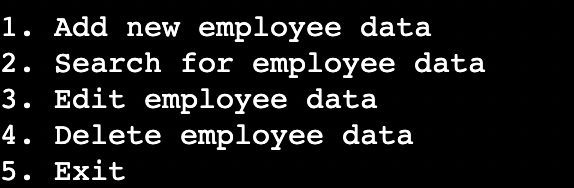
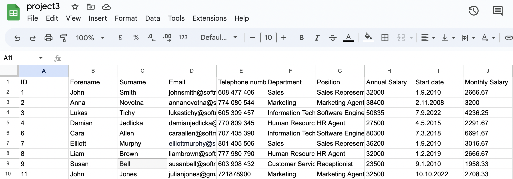
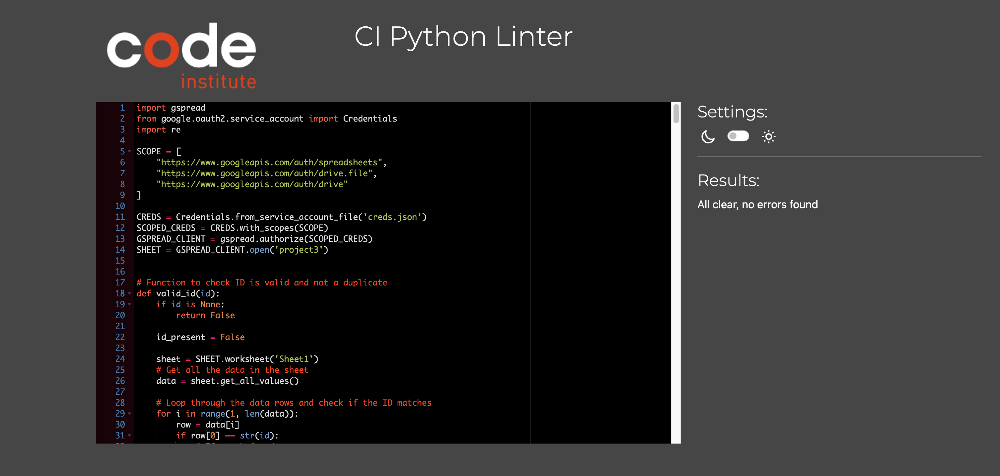

# Employee Management System
The Employee Management System is a software tool that enables users to manage employee data using a Google Sheet. 

## Features
There are 4 main features of the Employee Management System 

### Add new employee data
Option 1 allows the user to enter new employee forename, surname, email, telephone number, department, position, annual salary, and start date.

With correct entry of the data the Google sheet is updated with the new employee information and the user is provided with the confirmation message 'Employee data added successfully'. Monthly salary is automatically calculated from the annual salary. The main options are then once again presented. 

If all the data points required are not entered in the correct format the user is informed with the message 'Data validation failed' and the main options are presented.

### Search for employee data
Option 2 allows the user to search for a current employee by entering the employees ID.

If an ID is not matched the user is informed with the message 'No matching was found for the ID' and the main options are presented.

### Edit employee data
Option 3 allows the user to edit the data of a current employee after entering the employees ID.

### Delete employee data
Option 4 allows the user to delete the data of a current employee after entering the employees ID. The Google sheet is updated with the edited information.

### Exit
Option 5 allows the user to exit the program.

## User Experience (UX)

The software tool is designed to offer users a simple and efficient experience by enabling them to add, delete, search, and edit employee data in a Google Sheet. To enhance user experience, the following features have been implemented:

Input validation: The validate_data() function checks that the user's input contains the correct number of columns and provides clear feedback on how to correct errors.

Instructions for data entry: The get_employee_data() function offers instructions on how to enter data, along with an example.

Confirmation and error messages: Users receive confirmation messages when their actions are successful (e.g., adding an employee) and error messages when their input does not match any data in the sheet. These messages provide clarity and reduce uncertainty. 

## Flow Chart

## Google Sheet

## Future Features 
-The current code only allows searching for data based on the ID column. However, a future version could potentially enhance this functionality by enabling searching based on other parameters, such as name, email address, or department.

-The current code only validates the input data for the number of columns, but it does not perform any data validation checks on the content of each column. For instance, it does not verify whether the email address entered by the user is in a valid format. In a future version, data validation checks could be added for each column to ensure that the user's input data is accurate and reliable.

-A future version could include more detailed error messaging and interactive prompts to guide the user through the process.

-In a future iteration, incorporating HTML and CSS could enhance the program's usability by providing a user-friendly interface for users to interact with the program's functionality.

## Technologies Used
### Language
Python

### Frameworks, Libraries & Programs
* Google sheets - used to store and manage program data.
* Gspread - a python library that provides an interface to interact with Google. Sheets API.
* Google Auth - utilized to grant the app permission to interact with Google Sheets.
* Gitpod - employed to develop, modify, and compile the code for the program.
* Lucidchart - utilized for creating flow charts.
* Heroku -  used to deploy the application.

## Testing
[Code Institute Python Linter](https://pep8ci.herokuapp.com/#) - was used for validation to ensure no Python code errors.

## Manual Testing
Extensive testing was performed on the application, with special emphasis placed on validating user input and performing error checking to guarantee that the user is provided with appropriate feedback at all times.

The get employee data function offers instructions on how to enter data, along with an example.

The validate data function was used to validate the data entered by the user. It checks if the number of columns entered is equal to 9. If the new employee is added or current employee edited correctly the user is returned with the confirmation message 'Employee data added successfully' and 'Editing success' respectively. 

If the data entered is not in the correct format or the ID is not matched for editing the user is returned the message 'data validation failed' or "No matching data found" respectively, and presented with main options.

These messages provide clarity and reduce uncertainty. 

The application was tested on Google Chrome, Safari, Firefox and Microsoft Edge browsers without issues.

## Validation

## Bugs
Editing and deleting the last row

## Terminal Compatibility
Birthday Book is to be used and deployed via Heroku, and the terminal template provided by Code Institute. It is not compatible with a local terminal as certain positioning would be affected, even if the functionality of the programme would be unaltered.

## Deployment
Heroku

Deployment to Github Pages
The site was deployed to GitHub pages. Deployment requires the following steps:
In the GitHub repository, navigate to the Settings tab.
From the menu on left select 'Pages'.
From the source section drop-down menu, select the Branch: main.
Click 'Save'.
A link will be displayed in a green banner when published successfully. The link is available here. LINNKKKKKKKKKKKKKKKKKK

How to Clone
To clone a repository from GitHub to your local machine.
In the GitHub repository click the Code button above the repository files.
Copy the URL for the repository and choose either: HTTP, SSH or GitHub CLI.
Open your terminal and change the current working directory to the location where you would like the cloned directory.
Type git clone, paste the URL copied earlier and press enter.

## Credits
I would like to thank my mentor Rory Sheridan and all the tutors, teachers and student colleagues for help and advice on the project.

## Content and media
Instructions on how to use the forEach loop method was provided by free code camp.

Instructions on button enabling and disabling was provided by W3 schools.
