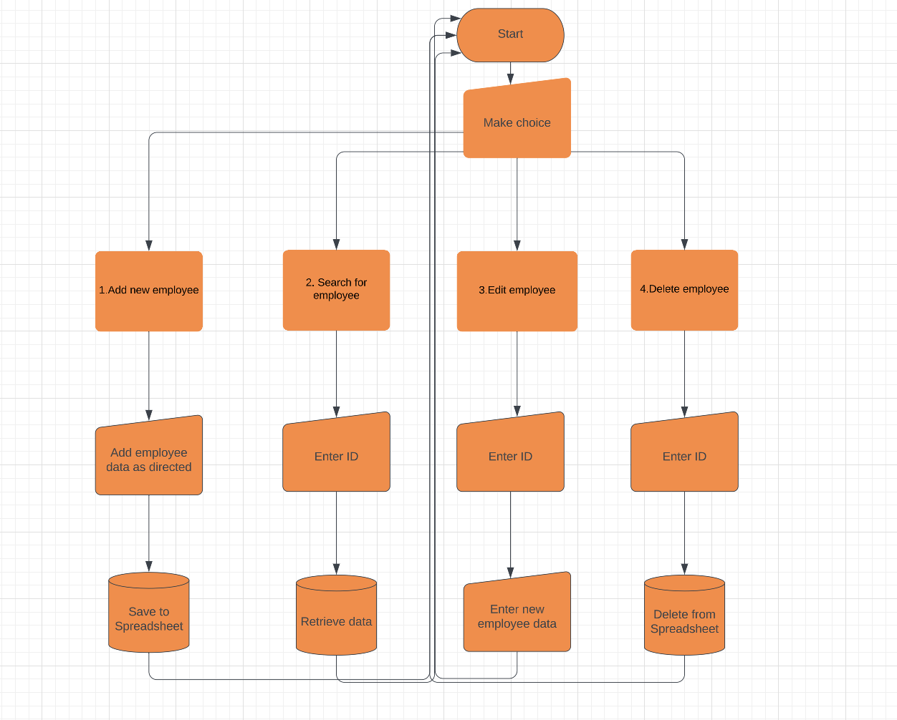

# Employee Management System
The [Employee Management System](https://project3tesarova.herokuapp.com/) is a software application that provides users with an effective means of managing employee data by utilizing Google Sheets. This tool is designed to streamline the management of employee information and improve the efficiency of HR processes. 

## Features
There are 4 main features of the Employee Management System 

### Add new employee data
Option 1 allows the user to enter new employee forename, surname, email, telephone number, department, position, annual salary, and start date.

With correct entry of the data the Google sheet is updated with the new employee information and the user is provided with the confirmation message 'Employee data added successfully'. Monthly salary is automatically calculated from the annual salary. The main options are then once again presented. 

If all the data points required are not entered in the correct format the user will be presented with a warning message and option to reenter the data correctly. For instance: ID already in use; empty field; '.' and '@' missing from email; date day less than 1 or greater than 31; '.' rather than '/' in date; 

### Search for employee data
Option 2 allows the user to search for a current employee by entering the employees ID.

If an ID is not matched the user is informed with the message 'No matching data was found for the ID' and the main options are presented.

### Edit employee data
Option 3 allows the user to edit the data of a current employee after entering the employees ID. If ID found the user will be presented with 'if you don't want to edit a data, please leave it empty by pressing enter key'. The user can then in effect scroll through the data points till the one required to be edited. With correct entry of the data the Google sheet is updated with the new employee information and the user is provided with the confirmation message 'Editing success'.

### Delete employee data
Option 4 allows the user to delete the data of a current employee after entering the employees ID. If the ID is found the employee is deleted from the Google sheet and user is provided with confirmation message 'Data deleted'.

## User Experience (UX)

The aim of our platform is to streamline employee management by storing and managing employee data efficiently in a Google Sheet. Our goal is to provide users such as HR managers and employees with a user-friendly interface to add, search, edit, and delete employee data securely in a centralized Google Sheet repository.

As a user, I want to add a new employee's data including their ID, name, contact details, department, position, salary, and start date into a Google sheet.

As a user, I want to search for an employee's data by entering their unique ID and view all their details stored in a Google sheet.

As a user, I want to edit an existing employee's information, updating any necessary details such as their name, contact information, department, position, salary, or start date.

As a user, I want to delete an employee's data from the system when they leave the company or if there's duplicate or erroneous information stored in the Google sheet.

To enhance user experience data prompts appear if the user inputs data in an incorrect format and the user is instructed to enter the data correctly. An example of the correct date format is also provided to guide the user. Users receive confirmation messages when their actions are successful (e.g. adding or deleting an employee) and a message when the ID does not match any data in the sheet. These messages provide clarity and reduce uncertainty.

## Flow Chart

## Google Sheet
The Python script interacts with a [Google Sheet](https://docs.google.com/spreadsheets/d/1BZB1oTjWcPVkBEoS4y_POWA-pKdTZbYmrg47M25pwfw/edit#gid=0) using the gspread library allowing the adding, deleting, editing and searching of employee data, in addition to calculating monthly salary. The program provides a basic user interface for interacting with the Sheet.

## Future Features 
The current code only allows searching for data based on the ID. However, a future version could potentially enhance this functionality by enabling searching based on other parameters, such as name, email address, or department.

In a future iteration, incorporating HTML and CSS could enhance the program's interface for users to interact with the program's functionality.

## Technologies Used
### Language
Python

### Frameworks, Libraries & Programs
* [Google sheets](https://www.google.com/sheets/about/) - used to store and manage program data.
* [Gspread](https://docs.gspread.org/en/v5.7.1/) - a Python library that simplifies the process of programmatically interacting with Google Sheets.
* [Google Auth](https://google-auth.readthedocs.io/en/master/) - a framework that provides a secure and easy way to enable the application to access Google APIs, such as Google Sheets API.
* [Github](https://github.com/) - cloud based hosting service to save and store the files.
* Git - version control system.
* [Lucidchart](https://www.lucidchart.com/pages/tour) - Utilized to create the flow chart.
* [Heroku](https://dashboard.heroku.com/apps) - used to deploy the application.

## Testing and Validation
[Code Institute Python Linter](https://pep8ci.herokuapp.com/#) - was used for validation to ensure no Python code errors.

## Manual Testing
Extensive manual testing was performed on the the menu-driven interface to manage an employee data system, with special emphasis placed on preventing the insertion of invalid or empty data, and ensuring user guidance if the user inputs invalid information.

### User story testing

Add New Employee:

Scenario 1: Input valid data for a new employee (ID, name, contact details, department, etc.) and verify it's correctly added to the Google Sheet, and 'Employee data added successfully' displayed.
Scenario 2: Attempt to add an employee with an existing ID and ensure the system rejects the addition, displaying 'Invalid option selected. Please try again'.
Scenario 3: Try adding an employee with invalid or incomplete data (e.g., missing name, incorrect email format) and confirm the system prompts for valid information (e.g. forneame cannot be empty, invalid email, etc).

All tests passed

Search Employee Data:

Scenario 1: Search for an existing employee by entering their valid ID and verify the system displays all their details accurately.
Scenario 2: Search for a non-existent employee ID and ensure the system handles it properly, displaying 'No matching data was found for the ID'.

All tests passed

Edit Employee Data:

Scenario 1: Update an existing employee's details (name, contact information, salary, etc.) and confirm the changes are accurately reflected in the Google Sheet, and 'Editing success' displayed.
Scenario 2: Attempt to update an employee with invalid data and verify the system prevents the update, and allows the user to resubmit correct data.

All tests passed

Delete Employee Data:

Scenario 1: Delete an existing employee's data and confirm that their record is removed entirely from the Google Sheet, and 'Data deleted' displayed.
Scenario 2: Try deleting a non-existent employee ID and ensure the system handles it appropriately, displaying 'No matching row found'.

All tests passed

## Bugs
The code has been fortified to handle exceptions and errors, particularly with input validation, data operations, and user interaction, to address potential issues and assist the user by providing informative messages.

An error was found with the editing and deleting of the last row of the sheet. The issue was caused by the use of range(1, len(data) - 1) in the for loop, which excluded the last row of the sheet. This problem was fixed by changing the range to range(1, len(data) + 1), which allowed the loop to iterate over all rows in the data list, including the last row. 

## Heroku Deployment
The Employee Management System has been designed to be deployed and utilized on Heroku. The terminal template was specifically created by Code Institute to be compatible with the Heroku platform. It may not function properly on a local terminal due to differences in positioning and other technical aspects, even if the program's functionality remains unchanged. Therefore, it is recommended to use the system exclusively on the Heroku platform.

* Fork or clone the repository from [GitHub](https://github.com/nataliatesarova/python_project3)
* Create a new Heroku app by logging in to the Heroku account and clicking the "New" button in the dashboard.
* In the "Deploy" tab of your Heroku app's dashboard, set the buildpacks to Python and NodeJS in that order.
* Link the Heroku app to the repository by going to the "Deploy" tab and selecting the GitHub deployment method. Then search for and connect the repository to Heroku.
* Click on the "Deploy" button to start the deployment process.

## Credits and Acknowledgements
I would like to thank my mentor Rory Sheridan and all the tutors, teachers and student colleagues for help and advice on the project.

Clarification on Elif Else statement [Programming with Mosh](https://www.youtube.com/watch?v=Zp5MuPOtsSY).

Instruction on While True in Python [Board Infinity](https://www.boardinfinity.com/blog/use-while-true-in-python/).

Instruction on Errors and Exceptions [Python](https://docs.python.org/3/tutorial/errors.html).
