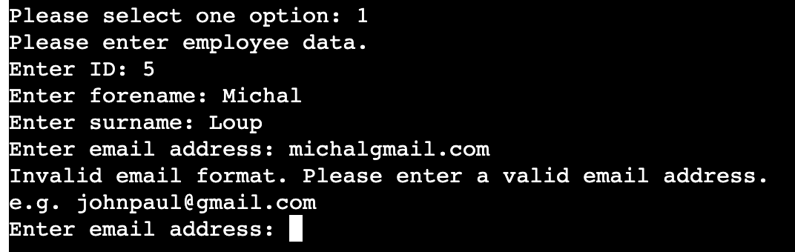
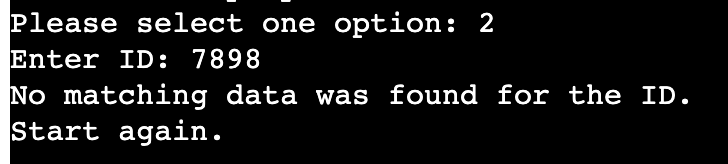
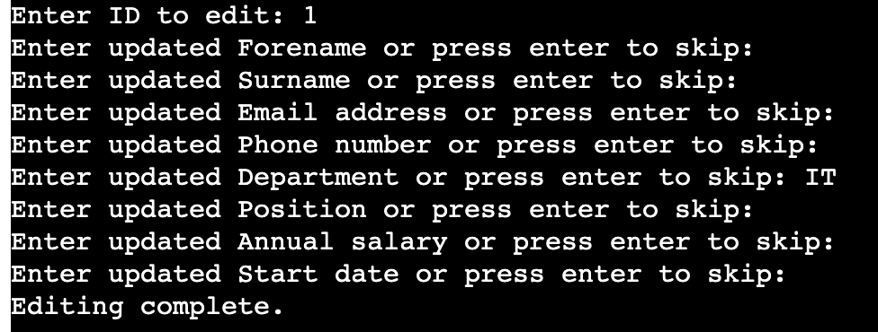
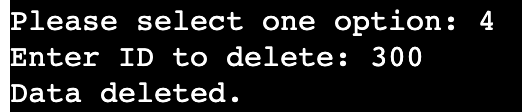

# Employee Management System
The [Employee Management System](https://project3tesarova.herokuapp.com/) is a software application that provides users with an effective means of managing employee data by utilizing Google Sheets. This tool is designed to streamline the management of employee information and improve the efficiency of HR processes. 

## Features
There are 4 main features of the Employee Management System 

### Add new employee data
Option 1 allows the user to enter new employee forename, surname, email, telephone number, department, position, annual salary, and start date.

With correct entry of the data the Google sheet is updated with the new employee information and the user is provided with the confirmation message 'Employee data added successfully'. Monthly salary is automatically calculated from the annual salary. The main options are then once again presented. 

If all the data points required are not entered in the correct format the user will be presented with a warning message and option to reenter the data correctly. For instance: ID already in use; empty field; '.' and '@' missing from email; date day less than 1 or greater than 31; '.' rather than '/' in date; 

### Search for employee data
Option 2 allows the user to search for a current employee by entering the employees ID.

If an ID is not matched the user is informed with the message 'No matching data was found for the ID' and the main options are presented.

### Edit employee data
Option 3 allows the user to edit the data of a current employee after entering the employees ID. If ID found the user will be presented with 'if you don't want to edit a data, please leave it empty by pressing enter key'. The user can then in effect scroll through the data points till the one required to be edited. With correct entry of the data the Google sheet is updated with the new employee information and the user is provided with the confirmation message 'Editing complete'.

### Delete employee data
Option 4 allows the user to delete the data of a current employee after entering the employees ID. If the ID is found the employee is deleted from the Google sheet and user is provided with confirmation message 'Data deleted'.

## User Experience (UX)

The aim of our platform is to streamline employee management by storing and managing employee data efficiently in a Google Sheet. Our goal is to provide users such as HR managers and employees with a user-friendly interface to add, search, edit, and delete employee data securely in a centralized Google Sheet repository.

As a user, I want to add a new employee's data including their ID, name, contact details, department, position, salary, and start date into a Google sheet.

As a user, I want to search for an employee's data by entering their unique ID and view all their details stored in a Google sheet.

As a user, I want to edit an existing employee's information, updating any necessary details such as their name, contact information, department, position, salary, or start date.

As a user, I want to delete an employee's data from the system when they leave the company or if there's duplicate or erroneous information stored in the Google sheet.

To enhance user experience data prompts appear if the user inputs data in an incorrect format and the user is instructed to enter the data correctly. An example of the correct date format is also provided to guide the user. Users receive confirmation messages when their actions are successful (e.g. adding or deleting an employee) and a message when the ID does not match any data in the sheet. These messages provide clarity and reduce uncertainty.

## Flow Chart

## Google Sheet
The Python script interacts with a [Google Sheet](https://docs.google.com/spreadsheets/d/1BZB1oTjWcPVkBEoS4y_POWA-pKdTZbYmrg47M25pwfw/edit#gid=0) using the gspread library allowing the adding, deleting, editing and searching of employee data, in addition to calculating monthly salary. The program provides a basic user interface for interacting with the Sheet.

## Future Features 
The current code only allows searching for data based on the ID. However, a future version could potentially enhance this functionality by enabling searching based on other parameters, such as name, email address, or department.

In a future iteration, incorporating HTML and CSS could enhance the program's interface for users to interact with the program's functionality.

## Technologies Used
### Language
Python

### Frameworks, Libraries & Programs
* [Google sheets](https://www.google.com/sheets/about/) - used to store and manage program data.
* [Gspread](https://docs.gspread.org/en/v5.7.1/) - a Python library that simplifies the process of programmatically interacting with Google Sheets.
* [Google Auth](https://google-auth.readthedocs.io/en/master/) - a framework that provides a secure and easy way to enable the application to access Google APIs, such as Google Sheets API.
* [Github](https://github.com/) - cloud based hosting service to save and store the files.
* Git - version control system.
* [Lucidchart](https://www.lucidchart.com/pages/tour) - Utilized to create the flow chart.
* [Heroku](https://dashboard.heroku.com/apps) - used to deploy the application.

## Testing and Validation
[Code Institute Python Linter](https://pep8ci.herokuapp.com/#) - was used for validation to ensure no Python code errors.

### Data Validity Checks 
In the Employee Management System, various data validity checks for maintaining data quality, preventing input errors, and ensuring the reliability of the Employee Management System. Here's a summary of the data validity checks and the reasoning behind them:
* ID Validation: Ensures that the ID entered for each employee is unique and a positive integer greater than 0. This prevents the system from assigning duplicate IDs and ensures consistency in data retrieval and management.
* Forename and Surname Validation: Forenames and surnames are essential personal identifiers and should only contain letters (alphabetic characters) and hyphens ("-"). This validation allows for the inclusion of double-barrelled names, where two surnames are joined by a hyphen, maintaining accuracy in name representation.
* Email Validation: Validates the format of the email address entered for each employee. It ensures that the email follows standard email address format rules to maintain communication accuracy and efficiency.
* Phone Number Validation: Checks that the phone number entered for each employee consists only of digits and is at least 7 characters long. This validation ensures that valid contact information is provided for each employee.
* Department and Position Input: While other fields disallow special characters, the department and position fields allow hyphens ("-"). This decision is made considering that department names and job positions often include hyphens for clarity or specificity (e.g., "Software Engineer - Level 2" or "HR - Department 2"). Allowing hyphens enhances the flexibility and usability of the system.
* Salary Validation: Salary input validation ensures that the entered salary is a valid, positive numerical value. Additionally, to accommodate European conventions where commas (",") are used as decimal separators, the validation process replaces commas with decimal dots. This conversion ensures consistency in salary formatting across different regions and prevents errors in financial data management.
* Date Validation: Ensures that the date entered for each employee's start date follows the format DD/MM/YYYY and falls within the acceptable range of years (1920-2024). Validating dates prevents data entry errors and ensures consistency in date formats throughout the system.

### Manual Testing
Extensive manual testing was performed on the the menu-driven interface to manage an employee data system, with special emphasis placed on preventing the insertion of invalid or empty data, and ensuring user guidance if the user inputs invalid information.

### User story testing

Add New Employee:

Scenario 1: Successfully input valid data for a new employee (ID, name, contact details, department, etc.), ensuring it's correctly added to the Google Sheet. Confirmation message 'Employee data added successfully' should be displayed.
Scenario 2: Attempt to add an employee with an ID that already exists in the system. The system should reject the addition and display the error message, 'ID already in use. Please try again'.
Scenario 3: Try to add an employee with invalid or incomplete data, such as a missing name or an incorrectly formatted email. The system should prompt for valid information with appropriate error messages like 'Forename cannot be empty', 'Invalid email format. Please enter a valid email address.', and guide the user to re-enter the data correctly.

All tests passed

Search Employee Data:

Scenario 1: Search for an existing employee by entering their valid ID. The system should accurately display all the details of the searched employee.
Scenario 2: Attempt to search for an employee using a non-existent ID. The system should handle this gracefully, informing the user with 'No matching data was found for the ID' and return to the main menu.

All tests passed

Edit Employee Data:

Scenario 1: Update an existing employee's details accurately (name, contact information, salary, etc.) and verify that the changes are reflected in the Google Sheet. A confirmation message 'Editing success' should be displayed.
Scenario 2: Attempt to update an employee's information with invalid data (e.g., entering alphabets in the salary field or an incorrect email format). The system should prevent the update and display relevant error messages such as 'Use valid number format.' for salary and 'Invalid email format. Please enter a valid email address.' for email, prompting the user to enter the correct data.

All tests passed

Delete Employee Data:

Scenario 1: Successfully delete an existing employee's data by entering their valid ID. Confirm that their record is removed from the Google Sheet, and the message 'Data deleted' is displayed.
Scenario 2: Try to delete an employee using a non-existent ID. The system should properly indicate that no matching data was found with the message 'ID does not exist in the sheet. Please enter a valid ID.', ensuring that the user is aware no action was taken.

All tests passed

## Bugs
* Editing and Deleting the Last Row: A critical bug was identified where the system failed to edit or delete data in the last row of the Google Sheet. This issue was traced back to the incorrect use of the range in a for-loop (range(1, len(data) - 1)) that inadvertently excluded the last row from being processed. The bug was fixed by adjusting the range to range(1, len(data) + 1), ensuring that the loop now correctly iterates over all rows, including the last one.

* Enhanced Field Validation: Previously, the system allowed empty inputs for key fields (forename, surname, department, position), leading to incomplete employee records. The issue was fixed by updating the get_valid_input function to reject empty inputs for these fields, ensuring all employee records are complete upon entry.

* Name Field Enhancements: Recognizing the prevalence of double-barrelled names, the system now allows the use of hyphens in the forename and surname fields. This adjustment ensures that individuals with hyphenated names are accurately represented in the system.

* Department and Position Field Flexibility: To accommodate a variety of naming conventions in department and position titles, the system has been updated to allow letters, numbers, and hyphens. This change provides the flexibility needed to accurately capture a wide range of job titles and department names within the organization.

* Email Validation Improvement: The email validity check has been refined to ensure that only correctly formatted email addresses are accepted. This improvement helps in reducing communication errors and ensures that all employees can be reliably contacted through their provided email addresses.

* Telephone Number Data Entry Validity: The telephone number validation process has been enhanced to enforce digit-only entries with a minimum length requirement. This update ensures that phone numbers are consistently recorded in a standardized format, improving the reliability of contact information.

* Salary Input Handling: Improvements were made to handle salary inputs more robustly, including the ability to convert commas to dots for decimal separation, which is common in some regions including some European countries. This change ensures that salary data is accurately captured and processed, regardless of regional formatting differences.

## Heroku Deployment
The Employee Management System has been designed to be deployed and utilized on Heroku. The terminal template was specifically created by Code Institute to be compatible with the Heroku platform. It may not function properly on a local terminal due to differences in positioning and other technical aspects, even if the program's functionality remains unchanged. Therefore, it is recommended to use the system exclusively on the Heroku platform.

* Fork or clone the repository from [GitHub](https://github.com/nataliatesarova/python_project3)
* Create a new Heroku app by logging in to the Heroku account and clicking the "New" button in the dashboard.
* In the "Deploy" tab of your Heroku app's dashboard, set the buildpacks to Python and NodeJS in that order.
* Link the Heroku app to the repository by going to the "Deploy" tab and selecting the GitHub deployment method. Then search for and connect the repository to Heroku.
* Click on the "Deploy" button to start the deployment process.

## Credits and Acknowledgements
I would like to thank my mentor Rory Sheridan and all the tutors, teachers and student colleagues for help and advice on the project.

Clarification on Elif Else statement [Programming with Mosh](https://www.youtube.com/watch?v=Zp5MuPOtsSY).

Instruction on While True in Python [Board Infinity](https://www.boardinfinity.com/blog/use-while-true-in-python/).

Instruction on Errors and Exceptions [Python](https://docs.python.org/3/tutorial/errors.html).
